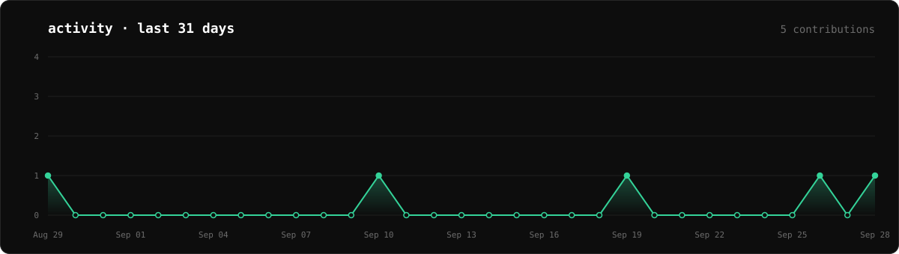

  

  

  
  
  
  

 

## `$ cat sobre.md`

Sou **Tech Lead** e lidero times de produto e engenharia — e continuo com a mão no código. Meu foco é **engenharia de software assistida por IA**: levar LLMs e agentes para dentro de produtos reais (atendimento, automação, análise) e para o próprio fluxo de desenvolvimento do time.

Hoje lidero as frentes de **Inovação, VIP e Implantação**, construindo plataformas internas do zero para substituir ferramentas SaaS caras por soluções próprias, sob medida e com IA no centro.

<b>Read in English</b>

 

I'm a **Tech Lead** who leads product and engineering teams — and still ships code. My focus is **AI-assisted software engineering**: bringing LLMs and agents into real products (customer service, automation, analytics) and into the team's own development workflow.

I currently lead the **Innovation, VIP and Implementation** areas, building internal platforms from scratch to replace costly SaaS tools with tailored, AI-first in-house solutions.

 

## `$ ls ~/projetos`

> Produtos internos e privados que eu e meu time construímos · *Internal, private products my team and I built*

| Projeto | O que faz · *What it does* |
|---|---|
| **Plataforma de Contact Center** | Omnichannel próprio (chat, e-mail, voz) com filas, tabulação, macros e observabilidade · *In-house omnichannel contact center* |
| **Chat Router** | Orquestrador de conversas proprietário que substituiu o Twilio Flex · *Proprietary chat orchestration replacing Twilio Flex* |
| **Agente de atendimento com IA** | Agente LLM integrado à plataforma, com RAG e cache semântico em pgvector · *LLM support agent with RAG + pgvector semantic cache* |
| **FAQ multi-marca** | Base de conhecimento própria com busca por IA, substituindo o Zendesk Guide · *AI-searchable multi-brand knowledge base* |
| **Análise com IA** | Pipeline que usa LLMs para triagem e análise de solicitações operacionais · *LLM pipeline for operational request triage* |
| **WFM** | Workforce Management sob medida: escalas, aderência e dimensionamento · *Custom workforce management* |
| **Plataforma unificada** | Ecossistema de ferramentas internas com SSO e RBAC · *Internal tools ecosystem with SSO + RBAC* |

 

## `$ ls ~/stack`

  

infra · IA · ferramentas

  
   
  
  
  
  
  

 

## `$ git log --stats`

  
  

  

  

  

 

  <picture>
    <source media="(prefers-color-scheme: dark)" srcset="./profile/snake-dark.svg" />
    <source media="(prefers-color-scheme: light)" srcset="./profile/snake-light.svg" />
    
  </picture>

 

## `$ ping julio`

  
  
  

Aberto a conversas sobre liderança técnica, IA aplicada e novos projetos.
 *Open to conversations about tech leadership, applied AI and new projects.*

 

